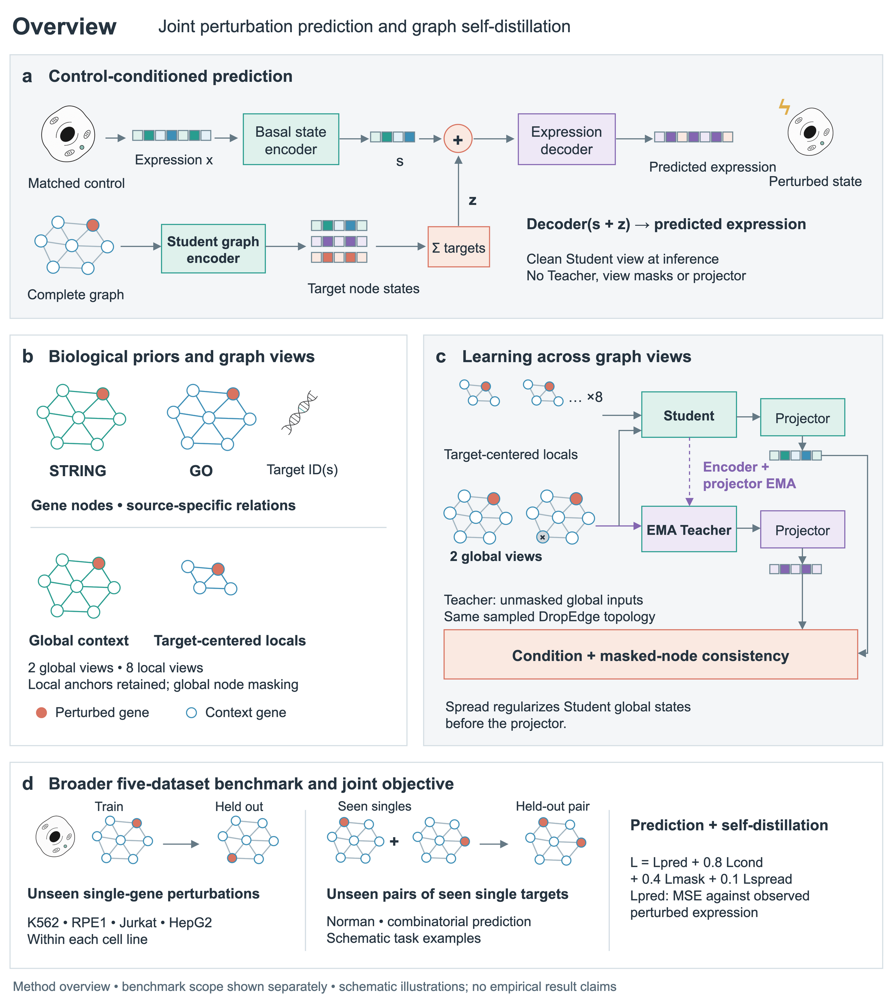
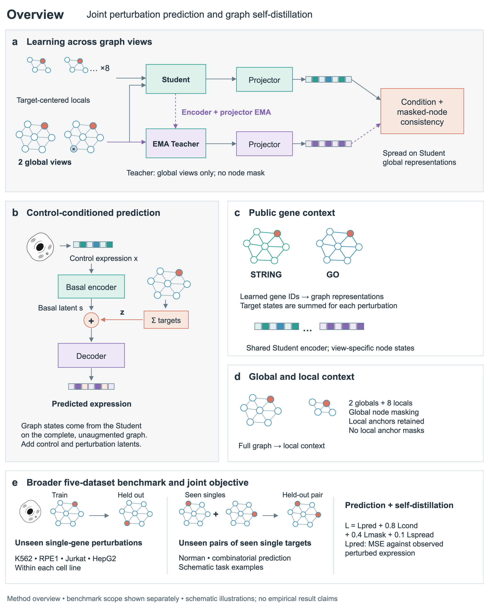
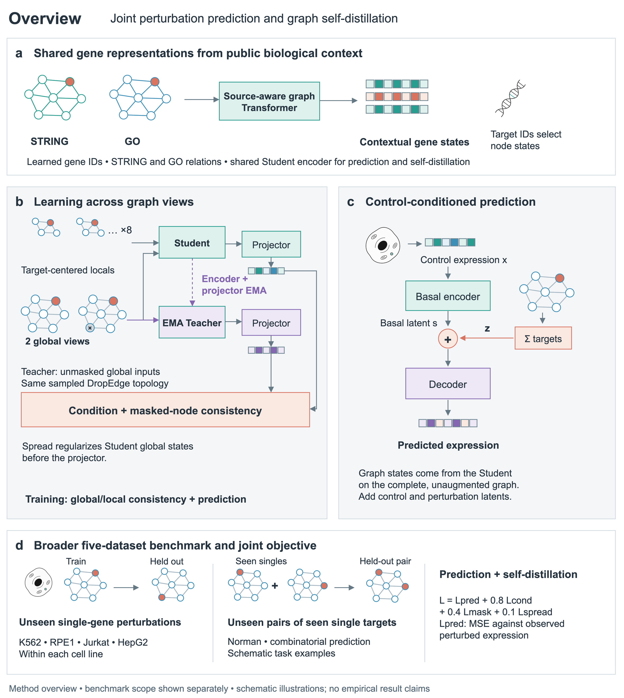
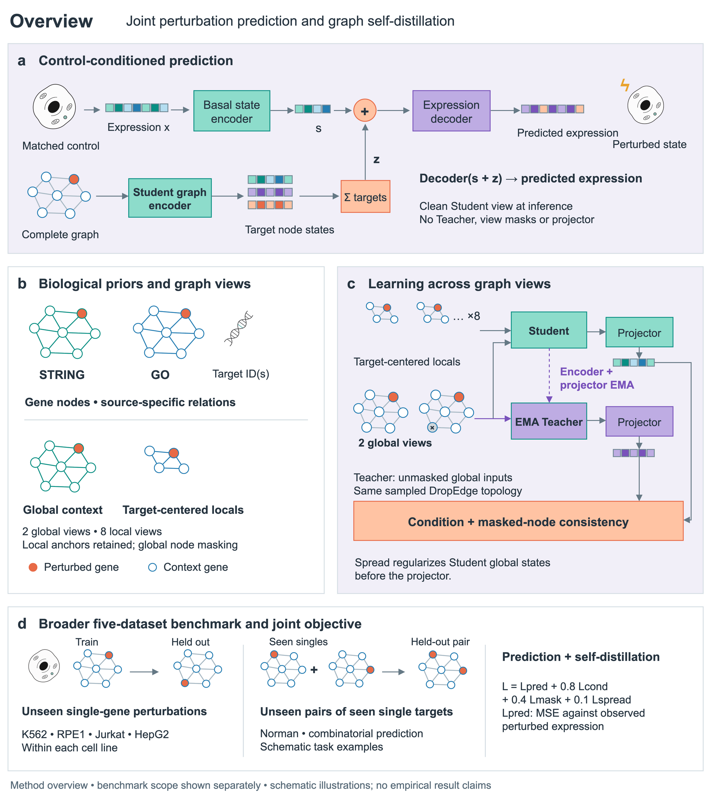
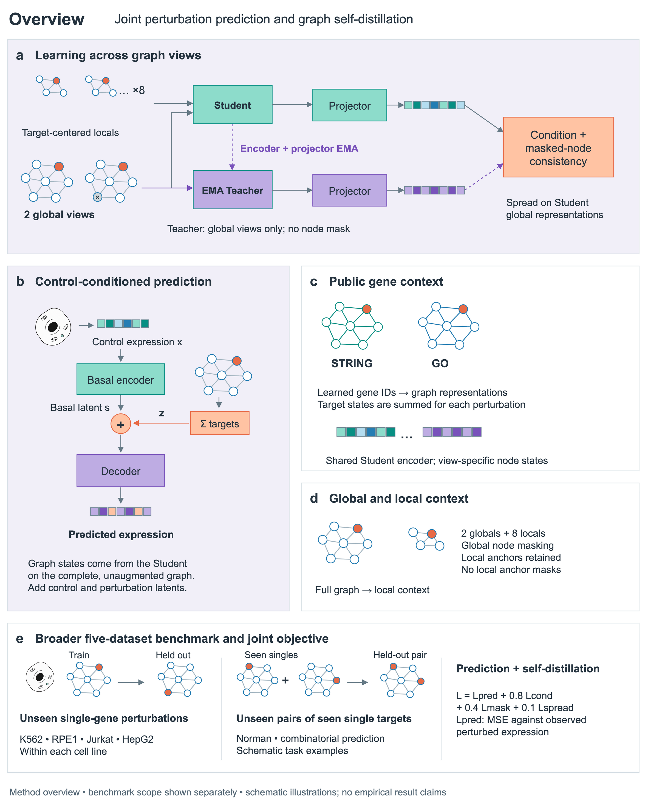
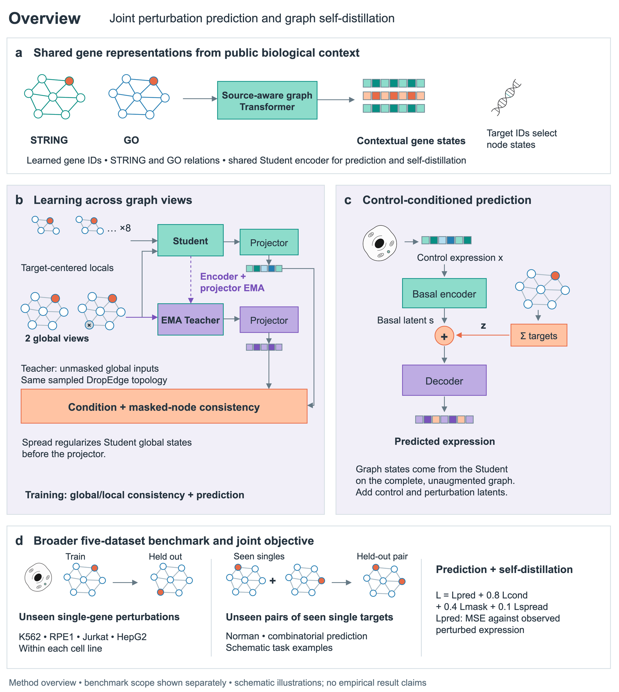

# Paper Overview Draw.io

**中文** · [English](README.en.md)

**给它一篇论文，画出 3 种构图 × 2 套配色，共 6 版可编辑的 Overview 图。**

先研究同领域优秀论文的实际图示，再根据你的方法设计多分图。支持正式科研素材、清楚的连线，以及独立子代理检查后的一次集中返修。输出 `.drawio` 源文件和 PNG、SVG、PDF。

## 六版示例

以下是一个使用中性标题的扰动预测方法示例。三种构图分别突出**预测主线、视图学习、共享表征**；每种都有克制与鲜艳两套配色，同一构图的内容和位置完全一致。点击图片查看大图。

| 配色 | 1 · 预测主线 | 2 · 视图学习 | 3 · 共享表征 |
| --- | --- | --- | --- |
| 克制 | [](examples/perturbation-overview/figures/design-1-restrained.png) | [](examples/perturbation-overview/figures/design-2-restrained.png) | [](examples/perturbation-overview/figures/design-3-restrained.png) |
| 鲜艳 | [](examples/perturbation-overview/figures/design-1-vivid.png) | [](examples/perturbation-overview/figures/design-2-vivid.png) | [](examples/perturbation-overview/figures/design-3-vivid.png) |

[六版源文件与导出](examples/perturbation-overview/README.md) · [完整生成提示词与方法说明（中英文）](examples/perturbation-overview/PROMPTS.md)

这个示例经过多轮设计与反馈。提示词是依据实际过程整理的复用版，不是单轮逐字记录；精确复用请打开配套源文件。图中网络、向量和任务均为示意，没有实测性能结果。文字、模块和箭头原生可编辑；细胞与 DNA 插图是嵌入的生成位图。

## 安装与使用

将仓库克隆到 Codex 技能目录；目标目录应尚不存在：

```bash
git clone https://github.com/elan6666/paper-overview-drawio.git ~/.codex/skills/paper-overview-drawio
```

然后在支持该技能的会话中使用：

```text
使用 $paper-overview-drawio，为这篇论文设计 Overview。
先学习同领域优秀论文的图示表达，再完成 3 种构图 × 2 套配色，共 6 版。
采用正式、简洁的论文示意风格；箭头清楚，叠放必须有科学含义。
由独立 subagent 检查实际导出图，汇总问题后集中返修一次。
论文路径：<你的论文或方法说明>
```

可补充目标期刊、页面宽度、偏好配色、希望突出的贡献，或提供想保留的旧图源文件。

## 工作方式

1. **理解方法**：梳理贡献、输入、机制和输出，区分已实现方法与设想。
2. **先学参考**：查看同领域论文的实际 overview 与图注，不套固定风格库。
3. **设计六版**：三种有实质区别的构图，各配克制、鲜艳两套颜色。
4. **初稿与 App 精修**：先生成可编辑 `.drawio` 初稿，再通过电脑操作工具在 draw.io App 中调整箭头、对齐、间距和样式，保存后导出；必要时加入正式平面素材或真实数据图。
5. **检查并返修一次**：独立子代理检查六张导出图的箭头、遮挡、对齐、可读性、无意义重复与科学关系；集中返修一次，再核对修复项。

丰富的信息应来自科学对象和机制，而不是装饰。单个 encoder 默认画成单个模块；只有能解释其实际含义时，才使用叠放、重复或透明度变化。长解释放到图注，图内使用短标签。

## 运行环境与输出

- 支持本地技能的代理环境，以及文件读写、论文检索和图像查看能力。App 内精修还需要可用的电脑操作工具；操作失败时会说明限制及文件修改回退，不会声称已通过界面修改。
- 需要生成素材时，使用环境提供的 `imagegen` 技能和生图工具；本仓库不提供模型或 API 凭据。
- `.drawio` 可在 draw.io / diagrams.net 中编辑。辅助导出使用 draw.io Desktop；`DRAWIO_PATH` 可指定程序路径。
- 可选依赖：`python3 -m pip install -r requirements.txt`。简单场景编译与语义检查只依赖标准库；PDF 处理和预览使用 PyMuPDF。
- SVG/PDF 可能含位图插图，不能仅凭文件格式宣称全矢量。实测数据图需要真实来源和可复现处理，不编造结果。

## 仓库内容

| 路径 | 用途 |
| --- | --- |
| [SKILL.md](SKILL.md) | 技能入口与工作流 |
| [examples/perturbation-overview/](examples/perturbation-overview/) | 六版完整示例、源文件、提示词和说明 |
| [references/](references/) | 参考学习、构图、素材、draw.io 与交付说明 |
| [scripts/overview.py](scripts/overview.py) | 可选的简单场景编译、导出与技术检查 |
| [scripts/compare_preview.py](scripts/compare_preview.py) | 三种构图的 PDF 等宽对比工具；两套配色可分别使用 |
| [assets/examples/](assets/examples/) | 最小编译测试用例，不是最终论文图的视觉标准 |
| [tests/](tests/) | 辅助脚本回归检查 |

```bash
python3 -m unittest discover -s tests -v
```

本例不限定其他论文的构图。实际设计由论文内容与当次参考学习驱动；最终科学内容由作者核对。
